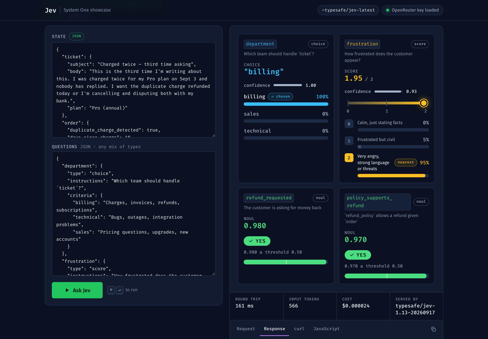

# Jev Showcase

An interactive playground for **Jev**, TypeSafe's "System One" decision model, called through **OpenRouter** with the `~typesafe/jev-latest` alias. One Node file, three static files, no dependencies.



Jev doesn't generate text. You send it your app's `state` plus typed `questions`, and it returns typed answers with probabilities. There is nothing to parse or validate; you branch on the value:

```js
const p = answers.refund_allowed.noul;
if (p >= 0.9) autoRefund();
else if (p <= 0.1) autoDecline();
else sendToHuman();
```

**No borrowed numbers.** TypeSafe quotes ~100 ms and calls its probabilities calibrated; this app repeats neither. Every latency shown in the UI is the measured round trip of your own call through OpenRouter (timed in `server.js`), and every cost is the amount OpenRouter reports billing. While building this, calls measured between 95 and 630 ms, most of them 100–350 ms. Your numbers will differ.

## The three ways to ask

| Type | You provide | Jev returns | Tab |
| --- | --- | --- | --- |
| `choice` | `instructions` + `criteria` as `{ option: description }` (up to 255) | `choice`, `probabilities` per option, `confidence` | **01 Choice** — ranked probability bars |
| `score` | `instructions` + `criteria` as an ordered array of 2–10 levels | continuous `score` (probability-weighted mean), `probabilities` per level, `confidence` | **02 Score** — marker on a scale + distribution |
| `noul` | `instructions` (a statement that is true or not) | `noul`: P(true), 0–1 | **03 Noul** — gauge with a draggable threshold |

A fourth tab, **All at once**, sends every type in one request against the same state. TypeSafe says questions are evaluated in parallel; compare that tab's measured round trip with a single-question tab to check.

Every tab has editable state and questions, example scenarios, live latency / token / cost readouts, and copyable request, response, `curl`, and JavaScript views.

## Examples

**Business decisions**

| Tab | Example | The decision |
| --- | --- | --- |
| Choice | Route a support ticket | which team: `billing` / `technical` / `sales` / `other` |
| Score | Bug severity · Customer frustration · Lead quality | where an input sits on a rubric you wrote in plain words |
| Noul | Prompt-injection check | does retrieved text try to redirect an assistant |
| All at once | **Refund decision** | department, frustration, refund requested, and whether policy allows it — four typed answers from one call, enough to auto-refund or escalate |

**Coding-agent gates**

| Tab | Example | The decision |
| --- | --- | --- |
| Choice | Route dev tasks to a model | which model tier gets each task: `claude_fable` / `kimi` / `glm` |
| Choice | Approve an agent action | approve, ask a human, or block a proposed tool call |
| Noul | Safe to run? | may an agent run this shell command without asking (`rm -rf … ~/.ssh`, `git push --force`, `curl \| sudo bash`, …). Strict threshold, 0.80 |
| Noul | Worth keeping? | context compaction: is each old message or tool result still needed for the current task. Lenient threshold, 0.30 |

Those two thresholds are deliberate opposites. For a shell gate a wrong *yes* is the expensive mistake; for compaction a wrong *no* is.

### Series

Several examples are **series**: a list of items judged with the same question, one request per item, all in flight at once. Each item carries a `predicted` answer, written before it was first run, so the results table shows where Jev and the author disagree. The misses are left in on purpose — "Validate signup input" comes back as a near coin flip between `kimi` and `glm` with confidence around 0.25, which is the case the `confidence` field exists for.

To add your own, give any choice or noul preset in `public/app.js` a `series: [{ label, state, predicted? }]` array (`predicted` is an option name for choice, `true`/`false` for noul).

## Run it

Requires Node 22.9+. No install step.

```bash
cp .env.example .env   # then set OPENROUTER_API_KEY (https://openrouter.ai/keys)
npm start              # http://localhost:3456
```

`npm run dev` restarts on file changes (it does not watch `.env`; restart after editing it). Without a key the UI still loads and shows the requests each mode would send.

## How it talks to OpenRouter

Jev is not a chat-completions model. The server proxies to OpenRouter's System One endpoint so the API key stays server-side:

```
POST https://openrouter.ai/api/v1/systemone
Authorization: Bearer $OPENROUTER_API_KEY

{
  "model": "~typesafe/jev-latest",
  "state": "…text or JSON…",
  "questions": {
    "department": { "type": "choice", "instructions": "…", "criteria": { "billing": "…", "technical": "…" } },
    "severity":   { "type": "score",  "instructions": "…", "criteria": ["low…", "medium…", "high…"] },
    "is_urgent":  { "type": "noul",   "instructions": "…" }
  }
}
```

A real response, trimmed:

```json
{
  "model": "typesafe/jev-1.13-20260917",
  "answers": {
    "department": { "type": "choice", "choice": "technical",
                    "probabilities": { "technical": 1, "sales": 0, "billing": 0 }, "confidence": 1 },
    "severity":   { "type": "score", "score": 2,
                    "legend": { "0": "Cosmetic; no impact", "1": "Degraded, workaround exists", "2": "Blocking; no workaround" },
                    "probabilities": { "0": 0, "1": 0, "2": 1 }, "confidence": 1 },
    "is_urgent":  { "type": "noul", "noul": 0.99 }
  },
  "usage": { "input_tokens": 430, "output_tokens": 71, "cost": 0.00001806 }
}
```

Answers come back under the keys you sent. A `choice` is always one of the option keys you supplied, a `score` echoes its `legend`, and `usage.cost` is what OpenRouter billed.

| Env var | Default |
| --- | --- |
| `OPENROUTER_API_KEY` | — (required) |
| `JEV_MODEL` | `~typesafe/jev-latest` |
| `JEV_ENDPOINT` | `https://openrouter.ai/api/v1/systemone` |
| `PORT` | `3456` |
| `HOST` | `127.0.0.1` |
| `RATE_LIMIT_PER_MIN` | `120` |

Notes:

- Jev is in **beta** on OpenRouter; a 404 for the model usually means it isn't enabled for your account yet.
- One community write-up uses `https://openrouter.ai/api/alpha/decisions` instead. Both paths exist; this app defaults to the documented `/api/v1/systemone`. Override with `JEV_ENDPOINT` if needed.
- Jev is text-only (strings, JSON objects, JSON arrays) with a 32k-token window. To decide about an image, describe it with a vision model first and send the description as `state`.

## Jev vs an LLM at a decision point

What this app can show, measured rather than quoted:

| | Jev | LLM asked for JSON |
| --- | --- | --- |
| Output shape | fixed by the question type before the call | a string you parse and validate, with retries |
| Options | `choice` is always one of yours | can invent a category; you check for it |
| Uncertainty | a probability over your options, plus `confidence` | none, or a number the model wrote in the text |
| Latency / cost | shown per call in the UI | measure your own baseline before quoting a ratio |

Where the LLM still wins: writing the reply, reasoning through a novel case, images, and long context. The pattern that falls out is *Jev decides, the LLM writes*.

## Deploying and key safety

- **The key is server-side only.** `server.js` reads `OPENROUTER_API_KEY` from the environment and adds the `Authorization` header itself. The browser only ever talks to `/api/decide`; `/api/config` exposes a `hasKey` boolean, never the key. The static handler serves `public/` only, so `.env` and `server.js` are unreachable over HTTP.
- **`.env` is gitignored.** Before any push, `git status` should not list it.
- **A public deploy is an open proxy on your credits.** Anyone who can reach `/api/decide` spends them. The server binds to `127.0.0.1` by default and rate-limits the endpoint (`RATE_LIMIT_PER_MIN`, default 120 per client). If you host it publicly, put it behind auth or use an OpenRouter key with a low credit limit.

## Video assets

`video/refund-snippet.html` renders the snippet at the top of this README full-screen in the app's colors, for screen recording. Add `?step` to reveal it line by line (click, space, or →). `video/refund-snippet.png` is the same frame at 3840×2160; re-render it with:

```bash
"/Applications/Google Chrome.app/Contents/MacOS/Google Chrome" --headless=new --disable-gpu --hide-scrollbars --window-size=1920,1080 --force-device-scale-factor=2 --virtual-time-budget=4000 --screenshot="$PWD/video/refund-snippet.png" "file://$PWD/video/refund-snippet.html"
```

## Layout

```
server.js            static files + POST /api/decide proxy + GET /api/config
public/index.html    page shell
public/app.js        mode definitions, examples, editors, visualizations
public/styles.css    design tokens and layout
video/               full-screen code slide for the video
docs/screenshot.png  README image
.claude/launch.json  dev-server config for the Claude desktop app's preview pane
```

## Sources

- [OpenRouter — TypeSafe SDK / System One docs](https://openrouter.ai/docs/guides/community/typesafe-sdk)
- [OpenRouter — Jev Lab](https://openrouter.ai/labs/jev)
- [TypeSafe docs — Noul](https://docs.typesafe.ai/primitives/noul)
- [TypeSafe — Introducing System One Models & Jev](https://typesafe.ai/blog/introducing-system-one-models-and-jev)
- [Flavio Copes — A deep dive into Jev](https://flaviocopes.com/jev/)
- [LangChain — A guide to TypeSafe AI's System One model](https://www.langchain.com/blog/building-a-harness-with-jev)
- [DEV — Routing OpenCode tasks with Jev](https://dev.to/lbobylev/routing-opencode-tasks-with-jev-2c4n)

## License

[MIT](LICENSE)
